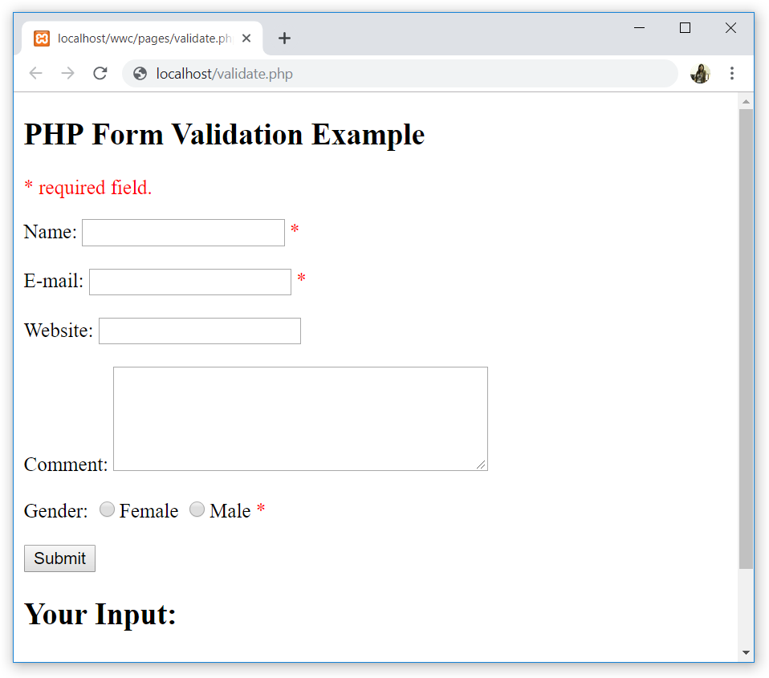

!>Think SECURITY when processing PHP forms! Proper validation of form data is important to protect your form from hackers and spammers!

The HTML form we will be working, contains various input fields: required and optional text fields, radio buttons, and a submit button:



The validation rules for the form above are as follows:

|**Field**|**Validation Rules**|
|---|---|
|Name|	Required. + Must only contain letters and whitespace|
|E-mail|	Required. + Must contain a valid email address (with @ and .)|
|Website|	Optional. If present, it must contain a valid URL|
|Comment|	Optional. Multi-line input field (textarea)|
|Gender|	Required. Must select one|

First we will look at the plain HTML code for the form:

### Text Fields
The name, email, and website fields are text input elements, and the comment field is a textarea. The HTML code looks like this:
```
Name: <input type="text" name="name">
E-mail: <input type="text" name="email">
Website: <input type="text" name="website">
Comment: <textarea name="comment" rows="5" cols="40"></textarea>
```
### Radio Buttons
The gender fields are radio buttons and the HTML code looks like this:
```
Gender:
<input type="radio" name="gender" value="female">Female
<input type="radio" name="gender" value="male">Male
<input type="radio" name="gender" value="other">Other
```
### The Form Element
The HTML code of the form looks like this:
```
<form method="post" action="<?php echo htmlspecialchars($_SERVER["PHP_SELF"]);?>">
```
When the form is submitted, the form data is sent with method="post".

!>**What is the $_SERVER["PHP_SELF"] variable?** The `$_SERVER["PHP_SELF"]` is a super global variable that returns the filename of the currently executing script.

So, the `$_SERVER["PHP_SELF"]` sends the submitted form data to the page itself, instead of jumping to a different page. This way, the user will get error messages on the same page as the form.

!>**What is the htmlspecialchars() function?** The `htmlspecialchars()` function converts special characters to HTML entities. This means that it will replace HTML characters like < and > with &lt; and &gt;. This prevents attackers from exploiting the code by injecting HTML or Javascript code (Cross-site Scripting attacks) in forms.

### Big Note on PHP Form Security
The `$_SERVER["PHP_SELF"]` variable can be used by hackers!
If `PHP_SELF` is used in your page then a user can enter a slash (/) and then some Cross Site Scripting (XSS) commands to execute.

!> Cross-site scripting (XSS) is a type of computer security vulnerability typically found in Web applications. XSS enables attackers to inject client-side script into Web pages viewed by other users.

Assume we have the following form in a page named "test_form.php":
```
<form method="post" action="<?php echo $_SERVER["PHP_SELF"];?>">
```
Now, if a user enters the normal URL in the address bar like "http://www.example.com/test_form.php", the above code will be translated to:
```
<form method="post" action="test_form.php">
```
So far, so good.
However, consider that a user enters the following URL in the address bar:
```
http://www.example.com/test_form.php/%22%3E%3Cscript%3Ealert('hacked')%3C/script%3E
```
In this case, the above code will be translated to:
```
<form method="post" action="test_form.php/"><script>alert('hacked')</script>
```
This code adds a script tag and an alert command. And when the page loads, the JavaScript code will be executed (the user will see an alert box). This is just a simple and harmless example how the PHP_SELF variable can be exploited.
Be aware of that any JavaScript code can be added inside the <script> tag! A hacker can redirect the user to a file on another server, and that file can hold malicious code that can alter the global variables or submit the form to another address to save the user data, for example.

### How To Avoid $_SERVER["PHP_SELF"] Exploits?
`$_SERVER["PHP_SELF"]` exploits can be avoided by using the htmlspecialchars() function.
The form code should look like this:
```
<form method="post" action="<?php echo htmlspecialchars($_SERVER["PHP_SELF"]);?>">
```
The `htmlspecialchars()` function converts special characters to HTML entities. Now if the user tries to exploit the PHP_SELF variable, it will result in the following output:
```
<form method="post" action="test_form.php/&quot;&gt;&lt;script&gt;alert('hacked')&lt;/script&gt;">
```
The exploit attempt fails, and no harm is done!

### Validate Form Data With PHP
The first thing we will do is to pass all variables through PHP's `htmlspecialchars()` function.

When we use the `htmlspecialchars()` function; then if a user tries to submit the following in a text field:

<script>location.href('http://www.hacked.com')</script>

- this would not be executed, because it would be saved as HTML escaped code, like this:

&lt;script&gt;location.href('http://www.hacked.com')&lt;/script&gt;

The code is now safe to be displayed on a page or inside an e-mail.

We will also do two more things when the user submits the form:

Strip unnecessary characters (extra space, tab, newline) from the user input data (with the PHP trim() function)
Remove backslashes (\) from the user input data (with the PHP stripslashes() function)
The next step is to create a function that will do all the checking for us (which is much more convenient than writing the same code over and over again).

We will name the function test_input().

Now, we can check each `$_POST` variable with the test_input() function, and the script looks like this:
```
<?php
// define variables and set to empty values
$name = $email = $gender = $comment = $website = "";

if ($_SERVER["REQUEST_METHOD"] == "POST") {
  $name = test_input($_POST["name"]);
  $email = test_input($_POST["email"]);
  $website = test_input($_POST["website"]);
  $comment = test_input($_POST["comment"]);
  $gender = test_input($_POST["gender"]);
}

function test_input($data) {
  $data = trim($data);
  $data = stripslashes($data);
  $data = htmlspecialchars($data);
  return $data;
}
?>
```
Notice that at the start of the script, we check whether the form has been submitted using `$_SERVER["REQUEST_METHOD"]`. If the REQUEST_METHOD is POST, then the form has been submitted - and it should be validated. If it has not been submitted, skip the validation and display a blank form.

However, in the example above, all input fields are optional. The script works fine even if the user does not enter any data.

The next step is to make input fields required and create error messages if needed.
